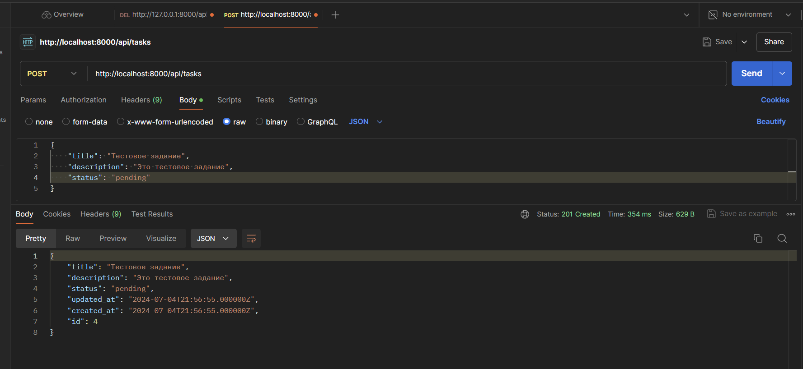
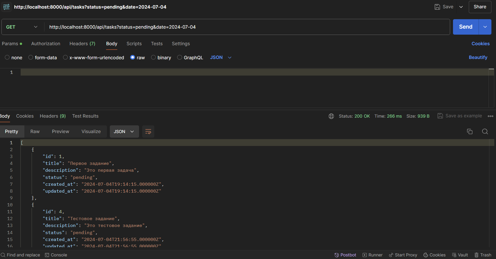
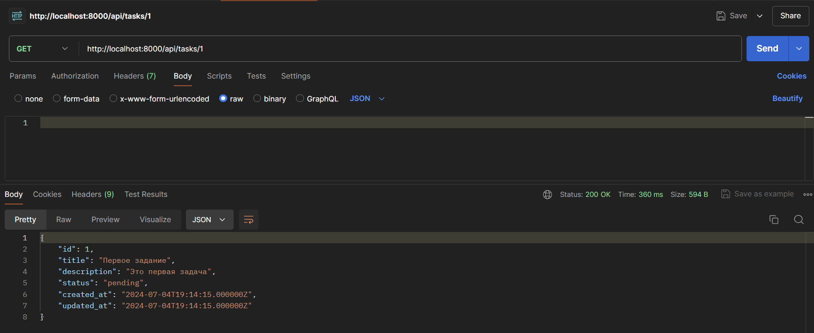
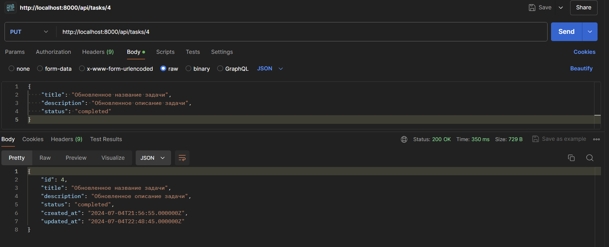
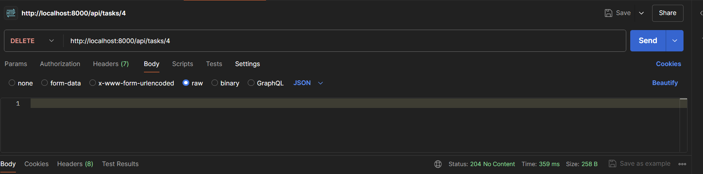

## Разработать простое приложение для управления задачами с использованием Laravel:

1. Создайте модель и миграцию для задачи.

2. Реализуйте API для создания, чтения, обновления и удаления задач.

3. Добавьте возможность фильтрации задач по статусу или дате.

### **Api / Postman**

#### *Создание задачи :*

-  **Метод**: POST

-  **URL**:  `http://localhost:8000/api/tasks`

-  **Тело запроса**: `JSON`

```
{
    "title": "Тестовое задание",
    "description": "Это тестовое задание",
    "status": "pending"
}
```




#### *Получение всех задач с фильтрацией :*

-  **Метод**: GET

-  **URL**: `http://localhost:8000/api/tasks?status=pending&date=2024-07-04`

-  **Параметры запроса**: (опционально)

   ```
   - status: (например, pending)
   - date: (например, 2024-07-04)
   ```




#### *Получение задачи по ID :*

-  **Метод**: GET

-  **URL**:  `http://localhost:8000/api/tasks/1`




#### *Обновление задачи :*

-  **Метод**: PUT

-  **URL**:  `http://localhost:8000/api/tasks/4`

-  **Тело запроса**:  `JSON`

```
{
    "title": "Обновленное название задачи",
    "description": "Обновленное описание задачи",
    "status": "completed"
}
```




#### *Удаление задачи :*

-  **Метод**: DELETE

-  **URL**:  `http://localhost:8000/api/tasks/4`




